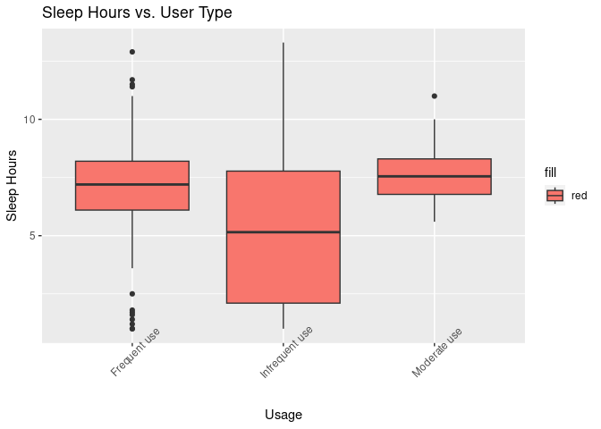

Bellabeat Fitness Project
================
Cynthia Adom-Portuphy

2022-12-22


## Table of Content

1.  [Summary](#Summary)

2.  [The Ask Phase](#The%20Ask%20Phase)

3.  [The Prepare Phase](#The%20Prepare%20Phase)

4.  [The Process Phase](#The%20Process%20Phase)

5.  [The Analysis Phase](#The%20Analysis%20Phase)

6.  [Conclusions and
    Recommendations](#Conclusions%20and%20Recommendations)

## 1. Summary

### 1.1 The company:

- Bellabeat is a high-tech manufacturer of health-focused products that
  empowers women to live heathy. Established in 2013, Bellabeat is a
  successful small company, but they have the potential to become a
  larger player in the global smart device market. Urška Sršen,
  cofounder and Chief Creative Officer of Bellabeat, hopes that that
  analyzing smart device fitness data could help unlock new growth
  opportunities for the company.Their products include: Bellabeat app,
  Leaf, Time, and Spring.

## 2. The Ask Phase

### 2.1 Selected Product

- Leaf: Bellabeat’s classic wellness tracker can be worn as a bracelet,
  necklace, or clip. The Leaf tracker connects to the Bellabeat app to
  track activity, sleep, and stress.
- The FiTBiT device function similarly to the Bellabeat Leaf, except it
  is worn on the wrest.

### 2.1 Statement of Business Task:

- Analyze trends in customer smart device usage for a non-Bellabeat
  device to identify potential growth areas and make recommendations for
  Bellabeat’s Leaf device marketing strategy improvement based on the
  insights gathered.

## A. The Prepare Phase

### 2.2 Stakeholders

- Urška Sršen, Bellabeat cofounder and Chief Creative Officer
- Sando Mur, Bellabeat cofounder and key member of Bellabeat executive
  team
- The Marketing Analytics team at Bellabeat

## 3. The Prepare Phase

### 3.1 Data Sources and Intergrity

- \*\* Data Source: FitBit data was gathered from Kaggle through Mobius
  that explores smart device users’ daily habits for thirty FitBit
  users. The data is original and reliable because it is from a credible
  company. The data is open source with no copyright limitations.
- \*\* Information about the data: These datasets were obtained from
  FitBit users between 03.12.2016-05.12.2016 through a survey via Amazon
  Mechanical Turk. Thirty eligible Fitbit users agreed to the survey and
  the submission of personal tracker data, including minute-level data
  for physical activity, heart rate, and sleep monitoring.
- \*\* Data Organization: The dataset consisted of 18 individual csv
  files, some were the same files presented in different formats or
  levels.
- \*\* Limitations of the data: The data is outdated,and has no
  demographic information. Besides, it has only limited unique records,
  the most being 31 records. However, considering that a sample size of
  30 is fairly common across statistics, we could still use the data to
  draw useful insights for experimental purposes.

### 3.2 Preliminary Data Screening in excel

- I preliminary imported the data into excel and used Pivot Tables to
  assess the number of records. This analysis led me to selecting four
  datasets that were relevant for my analysis.

- I also split the columns for the date columns for the respective
  datasets to make data joins possible. This involved renaming those
  columns into “date” and “time”.

- The four datasets are:

  - A. sleepDay_merged.csv (24 Records)
  - B. hourlyCalories_merged.csv (33)
  - C. dailyActivity_merged.csv (33)
  - D. hourlyIntensity_merged.csv (33)

## 4. The Process Phase

### 4.1 Load packages

``` r
install.packages("tidyverse")
```

    ## Installing package into '/cloud/lib/x86_64-pc-linux-gnu-library/4.2'
    ## (as 'lib' is unspecified)

``` r
install.packages("lubridate")
```

    ## Installing package into '/cloud/lib/x86_64-pc-linux-gnu-library/4.2'
    ## (as 'lib' is unspecified)

``` r
install.packages("ggplot2")
```

    ## Installing package into '/cloud/lib/x86_64-pc-linux-gnu-library/4.2'
    ## (as 'lib' is unspecified)

``` r
install.packages("plyr")
```

    ## Installing package into '/cloud/lib/x86_64-pc-linux-gnu-library/4.2'
    ## (as 'lib' is unspecified)

``` r
install.packages("tidyr")
```

    ## Installing package into '/cloud/lib/x86_64-pc-linux-gnu-library/4.2'
    ## (as 'lib' is unspecified)

``` r
install.packages("scales")
```

    ## Installing package into '/cloud/lib/x86_64-pc-linux-gnu-library/4.2'
    ## (as 'lib' is unspecified)

``` r
install.packages("dplyr")
```

    ## Installing package into '/cloud/lib/x86_64-pc-linux-gnu-library/4.2'
    ## (as 'lib' is unspecified)

``` r
library("tidyverse")
```

    ## ── Attaching packages
    ## ───────────────────────────────────────
    ## tidyverse 1.3.2 ──

    ## ✔ ggplot2 3.4.0      ✔ purrr   0.3.5 
    ## ✔ tibble  3.1.8      ✔ dplyr   1.0.10
    ## ✔ tidyr   1.2.1      ✔ stringr 1.4.1 
    ## ✔ readr   2.1.3      ✔ forcats 0.5.2 
    ## ── Conflicts ────────────────────────────────────────── tidyverse_conflicts() ──
    ## ✖ dplyr::filter() masks stats::filter()
    ## ✖ dplyr::lag()    masks stats::lag()

``` r
library("lubridate")
```

    ## Loading required package: timechange
    ## 
    ## Attaching package: 'lubridate'
    ## 
    ## The following objects are masked from 'package:base':
    ## 
    ##     date, intersect, setdiff, union

``` r
library("ggplot2")
library("tidyr")
library("scales")
```

    ## 
    ## Attaching package: 'scales'
    ## 
    ## The following object is masked from 'package:purrr':
    ## 
    ##     discard
    ## 
    ## The following object is masked from 'package:readr':
    ## 
    ##     col_factor

``` r
library("plyr")
```

    ## ------------------------------------------------------------------------------
    ## You have loaded plyr after dplyr - this is likely to cause problems.
    ## If you need functions from both plyr and dplyr, please load plyr first, then dplyr:
    ## library(plyr); library(dplyr)
    ## ------------------------------------------------------------------------------
    ## 
    ## Attaching package: 'plyr'
    ## 
    ## The following objects are masked from 'package:dplyr':
    ## 
    ##     arrange, count, desc, failwith, id, mutate, rename, summarise,
    ##     summarize
    ## 
    ## The following object is masked from 'package:purrr':
    ## 
    ##     compact

``` r
library("dplyr")
```

### 4.2 Import Data - I used the FitBit Tracker Data

``` r
bellabeat_activity <- read_csv(C:Desktop/Projects/Google_analytics_bellabeat_project/dailyActivity_merged.csv")
```

    ## Rows: 940 Columns: 15
    ## ── Column specification ────────────────────────────────────────────────────────
    ## Delimiter: ","
    ## chr  (1): date
    ## dbl (14): Id, TotalSteps, TotalDistance, TrackerDistance, LoggedActivitiesDi...
    ## 
    ## ℹ Use `spec()` to retrieve the full column specification for this data.
    ## ℹ Specify the column types or set `show_col_types = FALSE` to quiet this message.

``` r
bellabeat_calories <- read_csv(C:Desktop/Projects/Google_analytics_bellabeat_project/hourlyCalories_merged.csv")
```

    ## Rows: 22099 Columns: 7
    ## ── Column specification ────────────────────────────────────────────────────────
    ## Delimiter: ","
    ## chr  (2): ActivityHour, date
    ## dbl  (4): Id, Calories, TotalIntensity, AverageIntensity
    ## time (1): time
    ## 
    ## ℹ Use `spec()` to retrieve the full column specification for this data.
    ## ℹ Specify the column types or set `show_col_types = FALSE` to quiet this message.

``` r
bellabeat_intensity <- read_csv("C:Desktop/Projects/Google_analytics_bellabeat_project/hourlyIntensities_merged.csv")
```

    ## Rows: 22099 Columns: 6
    ## ── Column specification ────────────────────────────────────────────────────────
    ## Delimiter: ","
    ## chr  (2): ActivityHour, date
    ## dbl  (3): Id, TotalIntensity, AverageIntensity
    ## time (1): time
    ## 
    ## ℹ Use `spec()` to retrieve the full column specification for this data.
    ## ℹ Specify the column types or set `show_col_types = FALSE` to quiet this message.

``` r
bellabeat_sleep <- read_csv("C:Desktop/Projects/Google_analytics_bellabeat_project/sleepDay_merged.csv")
```

    ## Rows: 413 Columns: 7
    ## ── Column specification ────────────────────────────────────────────────────────
    ## Delimiter: ","
    ## chr (1): date
    ## dbl (6): Id, TotalSleepRecords, TotalMinutesAsleep, SleepHours, TotalTimeInB...
    ## 
    ## ℹ Use `spec()` to retrieve the full column specification for this data.
    ## ℹ Specify the column types or set `show_col_types = FALSE` to quiet this message.

### 4.3 Check the Data

``` r
head(bellabeat_sleep)
```

    ## # A tibble: 6 × 7
    ##           Id date      TotalSleepRecords TotalMinutesA…¹ Sleep…² Total…³ InBed…⁴
    ##        <dbl> <chr>                 <dbl>           <dbl>   <dbl>   <dbl>   <dbl>
    ## 1 2026352035 5/12/2016                 1             456     7.6     485     8.1
    ## 2 4319703577 5/12/2016                 1             302     5       321     5.4
    ## 3 4445114986 5/12/2016                 1             483     8.1     501     8.4
    ## 4 4702921684 5/12/2016                 1             404     6.7     442     7.4
    ## 5 5553957443 5/12/2016                 1             438     7.3     475     7.9
    ## 6 6962181067 5/12/2016                 1             516     8.6     535     8.9
    ## # … with abbreviated variable names ¹​TotalMinutesAsleep, ²​SleepHours,
    ## #   ³​TotalTimeInBed, ⁴​InBedHours

``` r
head(bellabeat_activity)
```

    ## # A tibble: 6 × 15
    ##         Id date  Total…¹ Total…² Track…³ Logge…⁴ VeryA…⁵ Moder…⁶ Light…⁷ Seden…⁸
    ##      <dbl> <chr>   <dbl>   <dbl>   <dbl>   <dbl>   <dbl>   <dbl>   <dbl>   <dbl>
    ## 1   1.50e9 4/12…   13162    8.5     8.5        0    1.88   0.550    6.06       0
    ## 2   1.50e9 4/13…   10735    6.97    6.97       0    1.57   0.690    4.71       0
    ## 3   1.50e9 4/14…   10460    6.74    6.74       0    2.44   0.400    3.91       0
    ## 4   1.50e9 4/15…    9762    6.28    6.28       0    2.14   1.26     2.83       0
    ## 5   1.50e9 4/16…   12669    8.16    8.16       0    2.71   0.410    5.04       0
    ## 6   1.50e9 4/17…    9705    6.48    6.48       0    3.19   0.780    2.51       0
    ## # … with 5 more variables: VeryActiveMinutes <dbl>, FairlyActiveMinutes <dbl>,
    ## #   LightlyActiveMinutes <dbl>, SedentaryMinutes <dbl>, Calories <dbl>, and
    ## #   abbreviated variable names ¹​TotalSteps, ²​TotalDistance, ³​TrackerDistance,
    ## #   ⁴​LoggedActivitiesDistance, ⁵​VeryActiveDistance, ⁶​ModeratelyActiveDistance,
    ## #   ⁷​LightActiveDistance, ⁸​SedentaryActiveDistance

``` r
head(bellabeat_calories)
```

    ## # A tibble: 6 × 7
    ##           Id ActivityHour   date      time   Calories TotalIntensity AverageIn…¹
    ##        <dbl> <chr>          <chr>     <time>    <dbl>          <dbl>       <dbl>
    ## 1 1503960366 4/12/2016 0:00 4/12/2016 00:00        81             20       0.333
    ## 2 1503960366 4/12/2016 1:00 4/12/2016 01:00        61              8       0.133
    ## 3 1503960366 4/12/2016 2:00 4/12/2016 02:00        59              7       0.117
    ## 4 1503960366 4/12/2016 3:00 4/12/2016 03:00        47              0       0    
    ## 5 1503960366 4/12/2016 4:00 4/12/2016 04:00        48              0       0    
    ## 6 1503960366 4/12/2016 5:00 4/12/2016 05:00        48              0       0    
    ## # … with abbreviated variable name ¹​AverageIntensity

``` r
head(bellabeat_intensity)
```

    ## # A tibble: 6 × 6
    ##           Id ActivityHour   date      time   TotalIntensity AverageIntensity
    ##        <dbl> <chr>          <chr>     <time>          <dbl>            <dbl>
    ## 1 1503960366 4/12/2016 0:00 4/12/2016 00:00              20            0.333
    ## 2 1503960366 4/12/2016 1:00 4/12/2016 01:00               8            0.133
    ## 3 1503960366 4/12/2016 2:00 4/12/2016 02:00               7            0.117
    ## 4 1503960366 4/12/2016 3:00 4/12/2016 03:00               0            0    
    ## 5 1503960366 4/12/2016 4:00 4/12/2016 04:00               0            0    
    ## 6 1503960366 4/12/2016 5:00 4/12/2016 05:00               0            0

``` r
glimpse(bellabeat_activity)
```

    ## Rows: 940
    ## Columns: 15
    ## $ Id                       <dbl> 1503960366, 1503960366, 1503960366, 150396036…
    ## $ date                     <chr> "4/12/2016", "4/13/2016", "4/14/2016", "4/15/…
    ## $ TotalSteps               <dbl> 13162, 10735, 10460, 9762, 12669, 9705, 13019…
    ## $ TotalDistance            <dbl> 8.50, 6.97, 6.74, 6.28, 8.16, 6.48, 8.59, 9.8…
    ## $ TrackerDistance          <dbl> 8.50, 6.97, 6.74, 6.28, 8.16, 6.48, 8.59, 9.8…
    ## $ LoggedActivitiesDistance <dbl> 0, 0, 0, 0, 0, 0, 0, 0, 0, 0, 0, 0, 0, 0, 0, …
    ## $ VeryActiveDistance       <dbl> 1.88, 1.57, 2.44, 2.14, 2.71, 3.19, 3.25, 3.5…
    ## $ ModeratelyActiveDistance <dbl> 0.55, 0.69, 0.40, 1.26, 0.41, 0.78, 0.64, 1.3…
    ## $ LightActiveDistance      <dbl> 6.06, 4.71, 3.91, 2.83, 5.04, 2.51, 4.71, 5.0…
    ## $ SedentaryActiveDistance  <dbl> 0, 0, 0, 0, 0, 0, 0, 0, 0, 0, 0, 0, 0, 0, 0, …
    ## $ VeryActiveMinutes        <dbl> 25, 21, 30, 29, 36, 38, 42, 50, 28, 19, 66, 4…
    ## $ FairlyActiveMinutes      <dbl> 13, 19, 11, 34, 10, 20, 16, 31, 12, 8, 27, 21…
    ## $ LightlyActiveMinutes     <dbl> 328, 217, 181, 209, 221, 164, 233, 264, 205, …
    ## $ SedentaryMinutes         <dbl> 728, 776, 1218, 726, 773, 539, 1149, 775, 818…
    ## $ Calories                 <dbl> 1985, 1797, 1776, 1745, 1863, 1728, 1921, 203…

``` r
colnames(bellabeat_activity)
```

    ##  [1] "Id"                       "date"                    
    ##  [3] "TotalSteps"               "TotalDistance"           
    ##  [5] "TrackerDistance"          "LoggedActivitiesDistance"
    ##  [7] "VeryActiveDistance"       "ModeratelyActiveDistance"
    ##  [9] "LightActiveDistance"      "SedentaryActiveDistance" 
    ## [11] "VeryActiveMinutes"        "FairlyActiveMinutes"     
    ## [13] "LightlyActiveMinutes"     "SedentaryMinutes"        
    ## [15] "Calories"

``` r
colnames(bellabeat_sleep)
```

    ## [1] "Id"                 "date"               "TotalSleepRecords" 
    ## [4] "TotalMinutesAsleep" "SleepHours"         "TotalTimeInBed"    
    ## [7] "InBedHours"

### 4.4 Checking for Duplicates

``` r
sum(duplicated(bellabeat_activity))
```

    ## [1] 0

``` r
sum(duplicated(bellabeat_sleep))
```

    ## [1] 3

``` r
sum(duplicated(bellabeat_calories))
```

    ## [1] 0

``` r
sum(duplicated(bellabeat_intensity))
```

    ## [1] 0

### 4.5 Remove the Duplicates

- The sleep data had the duplicates
- I rerun the line of code to confirm that the duplicates are removed.

``` r
bellabeat_sleep2 <- bellabeat_sleep %>%
  distinct() %>%
  drop_na()

sum(duplicated(bellabeat_sleep2))
```

    ## [1] 0

### 4.6 Running Simple Statistics to Gain general Insights on the Data

``` r
#activity 
Activity_summary_General <- 
  bellabeat_activity %>%
  summarise(average_steps=mean(TotalSteps),
            average_calories=mean(Calories),
            average_Totaldistance=mean(TotalDistance),
            average_sedendtaryminutes=mean(SedentaryMinutes),
            average_veryActive_Minutes = mean(VeryActiveMinutes))
```

``` r
Summary_sleep <- 
 bellabeat_sleep %>%
  summarise(average_sleephours=mean(SleepHours))
```

The results indicated that \* Average steps = 7,638 \* Average Calories
= 2,304 \* Average total distance = 5.5 \* Average sedentary time in
minutes = 991 \* Average very active time in minutes = 21 \* Average
sleep hours = 7.

### 4.7 Merging some of the dataframes

- I merged the activity and intensity and then activity and sleep data
  using a inner join for further analysis.

``` r
Merge_ActivityIntensity<- merge(bellabeat_activity, bellabeat_intensity, by =c ("Id", "date"))
glimpse(Merge_ActivityIntensity)
```

    ## Rows: 22,099
    ## Columns: 19
    ## $ Id                       <dbl> 1503960366, 1503960366, 1503960366, 150396036…
    ## $ date                     <chr> "4/12/2016", "4/12/2016", "4/12/2016", "4/12/…
    ## $ TotalSteps               <dbl> 13162, 13162, 13162, 13162, 13162, 13162, 131…
    ## $ TotalDistance            <dbl> 8.50, 8.50, 8.50, 8.50, 8.50, 8.50, 8.50, 8.5…
    ## $ TrackerDistance          <dbl> 8.50, 8.50, 8.50, 8.50, 8.50, 8.50, 8.50, 8.5…
    ## $ LoggedActivitiesDistance <dbl> 0, 0, 0, 0, 0, 0, 0, 0, 0, 0, 0, 0, 0, 0, 0, …
    ## $ VeryActiveDistance       <dbl> 1.88, 1.88, 1.88, 1.88, 1.88, 1.88, 1.88, 1.8…
    ## $ ModeratelyActiveDistance <dbl> 0.55, 0.55, 0.55, 0.55, 0.55, 0.55, 0.55, 0.5…
    ## $ LightActiveDistance      <dbl> 6.06, 6.06, 6.06, 6.06, 6.06, 6.06, 6.06, 6.0…
    ## $ SedentaryActiveDistance  <dbl> 0, 0, 0, 0, 0, 0, 0, 0, 0, 0, 0, 0, 0, 0, 0, …
    ## $ VeryActiveMinutes        <dbl> 25, 25, 25, 25, 25, 25, 25, 25, 25, 25, 25, 2…
    ## $ FairlyActiveMinutes      <dbl> 13, 13, 13, 13, 13, 13, 13, 13, 13, 13, 13, 1…
    ## $ LightlyActiveMinutes     <dbl> 328, 328, 328, 328, 328, 328, 328, 328, 328, …
    ## $ SedentaryMinutes         <dbl> 728, 728, 728, 728, 728, 728, 728, 728, 728, …
    ## $ Calories                 <dbl> 1985, 1985, 1985, 1985, 1985, 1985, 1985, 198…
    ## $ ActivityHour             <chr> "4/12/2016 0:00", "4/12/2016 1:00", "4/12/201…
    ## $ time                     <time> 00:00:00, 01:00:00, 02:00:00, 03:00:00, 04:0…
    ## $ TotalIntensity           <dbl> 20, 8, 7, 0, 0, 0, 0, 0, 13, 30, 29, 12, 11, …
    ## $ AverageIntensity         <dbl> 0.333333, 0.133333, 0.116667, 0.000000, 0.000…

``` r
Merge_ActivitySleep<- merge(bellabeat_activity, bellabeat_sleep2, by =c ("Id", "date"))
glimpse(Merge_ActivitySleep)
```

    ## Rows: 410
    ## Columns: 20
    ## $ Id                       <dbl> 1503960366, 1503960366, 1503960366, 150396036…
    ## $ date                     <chr> "4/12/2016", "4/13/2016", "4/15/2016", "4/16/…
    ## $ TotalSteps               <dbl> 13162, 10735, 9762, 12669, 9705, 15506, 10544…
    ## $ TotalDistance            <dbl> 8.50, 6.97, 6.28, 8.16, 6.48, 9.88, 6.68, 6.3…
    ## $ TrackerDistance          <dbl> 8.50, 6.97, 6.28, 8.16, 6.48, 9.88, 6.68, 6.3…
    ## $ LoggedActivitiesDistance <dbl> 0, 0, 0, 0, 0, 0, 0, 0, 0, 0, 0, 0, 0, 0, 0, …
    ## $ VeryActiveDistance       <dbl> 1.88, 1.57, 2.14, 2.71, 3.19, 3.53, 1.96, 1.3…
    ## $ ModeratelyActiveDistance <dbl> 0.55, 0.69, 1.26, 0.41, 0.78, 1.32, 0.48, 0.3…
    ## $ LightActiveDistance      <dbl> 6.06, 4.71, 2.83, 5.04, 2.51, 5.03, 4.24, 4.6…
    ## $ SedentaryActiveDistance  <dbl> 0, 0, 0, 0, 0, 0, 0, 0, 0, 0, 0, 0, 0, 0, 0, …
    ## $ VeryActiveMinutes        <dbl> 25, 21, 29, 36, 38, 50, 28, 19, 41, 39, 73, 3…
    ## $ FairlyActiveMinutes      <dbl> 13, 19, 34, 10, 20, 31, 12, 8, 21, 5, 14, 23,…
    ## $ LightlyActiveMinutes     <dbl> 328, 217, 209, 221, 164, 264, 205, 211, 262, …
    ## $ SedentaryMinutes         <dbl> 728, 776, 726, 773, 539, 775, 818, 838, 732, …
    ## $ Calories                 <dbl> 1985, 1797, 1745, 1863, 1728, 2035, 1786, 177…
    ## $ TotalSleepRecords        <dbl> 1, 2, 1, 2, 1, 1, 1, 1, 1, 1, 1, 1, 1, 1, 1, …
    ## $ TotalMinutesAsleep       <dbl> 327, 384, 412, 340, 700, 304, 360, 325, 361, …
    ## $ SleepHours               <dbl> 5.5, 6.4, 6.9, 5.7, 11.7, 5.1, 6.0, 5.4, 6.0,…
    ## $ TotalTimeInBed           <dbl> 346, 407, 442, 367, 712, 320, 377, 364, 384, …
    ## $ InBedHours               <dbl> 5.8, 6.8, 7.4, 6.1, 11.9, 5.3, 6.3, 6.1, 6.4,…

## 5. The Analysis Phase

### 5.1 Calories Analysis - Analyzing Steps vs. Calories

- I analyzed the relationship between total steps and calories.

``` r
ggplot(data = bellabeat_activity) +geom_point(mapping = aes(x = TotalSteps, y = Calories)) + labs(title = "Total steps and Calories", x = "Total Steps", y = "Calories") + geom_jitter(aes(x = TotalSteps, y = Calories))+ geom_smooth(aes(x = TotalSteps, y = Calories, color = "red"))
```

    ## `geom_smooth()` using method = 'loess' and formula = 'y ~ x'

<!-- -->

- As expected, there is a positive relationship between the total steps
  and the amount fo calories burned.

### 5.2 Calories Burned per Day of the Week

- Considering the positive relationship, I isolated calories and
  analyzed it against the days of the week to determine if the day of
  the weeks determines the number of calories users burn.

- I used boxplots for the analysis.

- First, I created a dataframe for the weekday using the date column.

``` r
Date_ActivitySleep<- Merge_ActivitySleep %>%
  mutate(date = as.Date(date, format("%m/%d/%Y")))
 
Weekdays_ActivitySleep<- Date_ActivitySleep %>%
  mutate(date = weekdays(date))
 glimpse(Weekdays_ActivitySleep)
```

    ## Rows: 410
    ## Columns: 20
    ## $ Id                       <dbl> 1503960366, 1503960366, 1503960366, 150396036…
    ## $ date                     <chr> "Tuesday", "Wednesday", "Friday", "Saturday",…
    ## $ TotalSteps               <dbl> 13162, 10735, 9762, 12669, 9705, 15506, 10544…
    ## $ TotalDistance            <dbl> 8.50, 6.97, 6.28, 8.16, 6.48, 9.88, 6.68, 6.3…
    ## $ TrackerDistance          <dbl> 8.50, 6.97, 6.28, 8.16, 6.48, 9.88, 6.68, 6.3…
    ## $ LoggedActivitiesDistance <dbl> 0, 0, 0, 0, 0, 0, 0, 0, 0, 0, 0, 0, 0, 0, 0, …
    ## $ VeryActiveDistance       <dbl> 1.88, 1.57, 2.14, 2.71, 3.19, 3.53, 1.96, 1.3…
    ## $ ModeratelyActiveDistance <dbl> 0.55, 0.69, 1.26, 0.41, 0.78, 1.32, 0.48, 0.3…
    ## $ LightActiveDistance      <dbl> 6.06, 4.71, 2.83, 5.04, 2.51, 5.03, 4.24, 4.6…
    ## $ SedentaryActiveDistance  <dbl> 0, 0, 0, 0, 0, 0, 0, 0, 0, 0, 0, 0, 0, 0, 0, …
    ## $ VeryActiveMinutes        <dbl> 25, 21, 29, 36, 38, 50, 28, 19, 41, 39, 73, 3…
    ## $ FairlyActiveMinutes      <dbl> 13, 19, 34, 10, 20, 31, 12, 8, 21, 5, 14, 23,…
    ## $ LightlyActiveMinutes     <dbl> 328, 217, 209, 221, 164, 264, 205, 211, 262, …
    ## $ SedentaryMinutes         <dbl> 728, 776, 726, 773, 539, 775, 818, 838, 732, …
    ## $ Calories                 <dbl> 1985, 1797, 1745, 1863, 1728, 2035, 1786, 177…
    ## $ TotalSleepRecords        <dbl> 1, 2, 1, 2, 1, 1, 1, 1, 1, 1, 1, 1, 1, 1, 1, …
    ## $ TotalMinutesAsleep       <dbl> 327, 384, 412, 340, 700, 304, 360, 325, 361, …
    ## $ SleepHours               <dbl> 5.5, 6.4, 6.9, 5.7, 11.7, 5.1, 6.0, 5.4, 6.0,…
    ## $ TotalTimeInBed           <dbl> 346, 407, 442, 367, 712, 320, 377, 364, 384, …
    ## $ InBedHours               <dbl> 5.8, 6.8, 7.4, 6.1, 11.9, 5.3, 6.3, 6.1, 6.4,…

``` r
ggplot(data = Weekdays_ActivitySleep) +geom_boxplot(mapping = aes(x = date,  y = Calories, fill = "darkred")) + labs(title = "Calories Burned per Day of the Week", x = "Day", y = "Calories")
```

<!-- -->

- The results showed that Saturdays have the highest mean distribution,
  which means users are more active on Saturdays, which is to be
  expected considering they are mostly home and have more time to
  exercise. Other days when users are relatively more active are Mondays
  and Tuesdays. Sundays record the lowest calories burned.

### 5.3 Calories Burned and Activeness

*I analyzed the relationship between calories burned and activeness to
determine the extent to which the level of activity impacts calories *
The first step was to ascertain the type of users based on activeness.
\* According to community access network, taking more than 10,000 steps
daily is considered active. The rest of the categories they spell out
are below:

    * Sedentary is less than 5,000 steps per day 
    * Low active is 5,000 to 7,499 steps per day
    * Somewhat active is 7,500 to 9,999 steps per day
    * Active is more than 10,000 steps per day
    * Highly active is more than 12,500 

- Based on their classification, I grouped the calories column in the
  calories data into three groups: sedentary, somewhat active
  (comprising categories 2 and 3), and active (comprising categories 4
  and 5).But before then, I calculated the average total steps to
  normalize the data.

``` r
user_activitylevel <- Merge_ActivityIntensity %>%
  mutate(user_activitylevel = case_when(
  TotalSteps < 5000 ~ "sedentary",
   TotalSteps >= 5000 &   TotalSteps < 9999 ~ "somewhat active", 
      TotalSteps >= 10000 ~ "active"
  ))

head(user_activitylevel)
```

    ##           Id      date TotalSteps TotalDistance TrackerDistance
    ## 1 1503960366 4/12/2016      13162           8.5             8.5
    ## 2 1503960366 4/12/2016      13162           8.5             8.5
    ## 3 1503960366 4/12/2016      13162           8.5             8.5
    ## 4 1503960366 4/12/2016      13162           8.5             8.5
    ## 5 1503960366 4/12/2016      13162           8.5             8.5
    ## 6 1503960366 4/12/2016      13162           8.5             8.5
    ##   LoggedActivitiesDistance VeryActiveDistance ModeratelyActiveDistance
    ## 1                        0               1.88                     0.55
    ## 2                        0               1.88                     0.55
    ## 3                        0               1.88                     0.55
    ## 4                        0               1.88                     0.55
    ## 5                        0               1.88                     0.55
    ## 6                        0               1.88                     0.55
    ##   LightActiveDistance SedentaryActiveDistance VeryActiveMinutes
    ## 1                6.06                       0                25
    ## 2                6.06                       0                25
    ## 3                6.06                       0                25
    ## 4                6.06                       0                25
    ## 5                6.06                       0                25
    ## 6                6.06                       0                25
    ##   FairlyActiveMinutes LightlyActiveMinutes SedentaryMinutes Calories
    ## 1                  13                  328              728     1985
    ## 2                  13                  328              728     1985
    ## 3                  13                  328              728     1985
    ## 4                  13                  328              728     1985
    ## 5                  13                  328              728     1985
    ## 6                  13                  328              728     1985
    ##     ActivityHour     time TotalIntensity AverageIntensity user_activitylevel
    ## 1 4/12/2016 0:00 00:00:00             20         0.333333             active
    ## 2 4/12/2016 1:00 01:00:00              8         0.133333             active
    ## 3 4/12/2016 2:00 02:00:00              7         0.116667             active
    ## 4 4/12/2016 3:00 03:00:00              0         0.000000             active
    ## 5 4/12/2016 4:00 04:00:00              0         0.000000             active
    ## 6 4/12/2016 5:00 05:00:00              0         0.000000             active

``` r
user_activitylevelsleep <- Merge_ActivitySleep%>%
  mutate(user_sleep = case_when(
  TotalSteps < 5000 ~ "sedentary",
   TotalSteps >= 5000 &   TotalSteps < 9999 ~ "somewhat active", 
      TotalSteps >= 10000 ~ "active"
  ))
```

- I then created a bar chart to show the distribution visually.

``` r
ggplot(data = user_activitylevel) +geom_bar(mapping = aes(x = user_activitylevel, fill = "red")) + labs(title = "User Active Level", x = "Activity level", y = "Count")
```

<!-- -->

- The results from the user activity level showed that those who are
  active/very active form about 30% of the entire user population, the
  somewhat active was slightly higher, but the sedentary category also
  had another 32% which is quite high.

- Now, I created a boxplot to show calories burned based on activeness.

``` r
ggplot(data = user_activitylevelsleep) +geom_boxplot(mapping = aes(x = user_sleep,  y = Calories, fill = "darkred")) + labs(title = "User Active Level vs. Calories", x = "Activity level", y = "Calories")
```

<!-- -->

- Those that are active burn relatively more calories than the other
  categories, further proving the importance of physical activity on
  women’s health.

### 5.4 Frequency of Smart Device Usage

- After determining the user activity level, I analyzed the extent to
  which users actively use the smart device. The data spans across a
  month, which is 31 days. So, I split the data into high, medium and
  low usage.

  - High usage - user uses the device between 21 - 31 days.
  - Moderate usage - user uses the device between 11 - 20 days.
  - Low usage - user uses the device between 1 - 10 days.

``` r
daily_usage1 <- Merge_ActivitySleep %>%
  group_by(Id) %>%
  dplyr::summarize(days_used=sum(n())) %>%
  mutate(usage = case_when(
    days_used >= 1 & days_used <= 10 ~ "Infrequent use",
    days_used >= 11 & days_used <= 20 ~ "Moderate use", 
    days_used >= 21 & days_used <= 31 ~ "Frequent use", 
  ))
```

- I created a percent dataframe to standardize the distribution for the
  three categories.

``` r
daily_usage_percent <- daily_usage1 %>%
  group_by(usage) %>%
  dplyr::summarise(total = n())%>%
  mutate(total_daysused = sum(total)) %>%
  group_by(usage)%>%
  summarise(total_percent = total/total_daysused)%>%
  mutate(labels = scales::percent(total_percent)) 


User_Type = c("frequent use","infrequent use","moderate use")
daily_usage_percent2 <-cbind(daily_usage_percent, User_Type)
glimpse(daily_usage_percent)
```

    ## Rows: 3
    ## Columns: 2
    ## $ total_percent <dbl> 0.500, 0.375, 0.125
    ## $ labels        <chr> "50%", "38%", "12%"

- I then created a pie chart to display the distribution.

``` r
  ggplot(daily_usage_percent2, aes(x="",y=total_percent, fill=User_Type)) +
  geom_bar(stat = "identity", width = 1)+
  coord_polar("y", start=0)+
  theme_minimal()+
  theme(axis.title.x= element_blank(),
        axis.title.y = element_blank(),
        panel.border = element_blank(), 
        panel.grid = element_blank(), 
        axis.ticks = element_blank(),
        axis.text.x = element_blank(),
        plot.title = element_text(hjust = 0.5, size=14, face = "bold")) +
  scale_fill_manual(values=c("#004D99", "#3399FF", "#CCE6FF"))+
  geom_text(aes(label = labels),
            position = position_stack(vjust = 0.5))+
  labs(title = "Frequency of Smart Device Usage")
```

<!-- -->

## 5.5 Analyzing Intensities

- An analysis of time against intensity helped to determine what times
  users are either the most active or inactive.

``` r
Time_Intensity <- user_activitylevel %>%
  group_by(time) %>%
  dplyr:: summarise(mean_tot_intensity = mean(TotalIntensity))


ggplot(data = Time_Intensity, aes(x =time, y =mean_tot_intensity))+ geom_histogram(stat = "identity", fill='blue') +
  theme(axis.text.x = element_text(angle = 90)) +
  labs(title="Average Total Intensity vs. Time", x = "Time", y = "Average Intensity")
```

    ## Warning in geom_histogram(stat = "identity", fill = "blue"): Ignoring unknown
    ## parameters: `binwidth`, `bins`, and `pad`

<!-- -->

- The total intensity vs. time analysis showed that generally, most
  users are more active between 5 am and 10pm, but it peaks between 5pm
  and 7pm.

## 5.6 Average Sedentary time and Calories

- I also analyzed the relationship between mean calories and mean
  sedentary time to understand how inactivity impacts calories and
  overall health.

``` r
 Sed_Calories <- user_activitylevel %>%
  group_by(time)%>%
  dplyr::summarise(mean_calories = mean(Calories),
            mean_sedmin = mean(SedentaryMinutes))
```

``` r
ggplot(data = Sed_Calories) +geom_point(mapping = aes(x =mean_sedmin, y =mean_calories )) + labs(title = "Average Sedentary time and Calories", x = "Average Sedentary Time", y = "Average Calories") + geom_jitter(aes(x =mean_sedmin , y =mean_calories ))+ geom_smooth(aes(x =mean_sedmin, y =mean_calories, color = "red"))
```

    ## `geom_smooth()` using method = 'loess' and formula = 'y ~ x'

<!-- -->

- As expected, users that are more sedentary burn less calories; the
  relationship is almostly perfectly linear.

### 5.7 Analyzing sleep patterns

- Analyzing the sleep pattern of users began with an analysis of the
  number of hours users sleep daily.

``` r
ggplot(data = bellabeat_sleep)+ geom_bar(mapping = aes(y = SleepHours, color = "red"))+ labs(title = "Sleep Hours", x = "Count", y = "Sleep Hours")
```

<!-- -->

- Most users sleep averagely between 6 and 8 hours.

### 5.8 Sleep Hours Per Day of the Week

\*I further analyzed how the day of the week affects sleep.

``` r
ggplot(data = Weekdays_ActivitySleep)+ geom_boxplot(mapping = aes(x =date, y = SleepHours, fill= "red"))+ geom_smooth(aes(x = date, y = SleepHours))+ labs(title = "Sleep Hours Per Day of the Week", x = "Day", y = "Sleep Hours")
```

    ## `geom_smooth()` using method = 'loess' and formula = 'y ~ x'

<!-- -->

- Whereas Sundays have the lowest calories burned, conversely, users
  often sleep in on Sundays. They also sleep relatively more on
  Wednesdays, probably due to fatigue during the mid-week.

### 5.9 Sleep Hours Vs. User Type vs. Activeness

- I wanted to figure out if the user type (frequent, moderate and
  infrequent user) and activeness (sedentary, somewhat active, active)
  impacts their sleep or otherwise.

- I merged the data with the weekdays for the sleep dataframe and the
  daily use dataframe with the frequency of usage data.

``` r
Weekdays_ActivitySleep_Usage <- merge(daily_usage1, Weekdays_ActivitySleep, by = c("Id"))

ggplot(data = Weekdays_ActivitySleep_Usage)+ geom_boxplot(mapping = aes(x =usage, y = SleepHours, fill = "red"))+ geom_smooth(aes(x =usage, y = SleepHours))+ labs(title = "Sleep Hours vs. User Type", x = "Usage", y = "Sleep Hours")+theme(axis.text.x=element_text(angle=45))
```

    ## `geom_smooth()` using method = 'loess' and formula = 'y ~ x'

<!-- -->

``` r
ggplot(data = user_activitylevelsleep)+ geom_bar(mapping = aes(x = SleepHours, color = "red"))+facet_wrap(~user_sleep)+ labs(title = " Sleep Hours and Activeness", x = "Sleep Hours", y = "Amount")
```

<!-- -->

- Interestingly, the moderate users had slightly more hours of sleep
  than the frequent users, but by a very small margin. However the
  infrequent users had the least amount of sleep; much lower than the
  otehr two categories.

- In addition, those that are more active have a better sleeping habit;
  they sleep relatively more hours than the other two categories. Not
  surprisingly, those that are sedentary sleep the least hours.

## 6.0. Conclusions and Recommendations

### Conclusions

- Bellabeat’s mission is to empower women through fitness. Focusing on
  the Leaf, this project sought to reveal trends in data to better
  inform how to promote this agenda. The results from the study revealed
  some interesting patterns in physical activity, calories burned and
  sleep patterns, which can be used as proxy measures to understand and
  predict user’s behaviors. We can also draw some conclusions from the
  analyses to inform the marketing strategy of Bellabeat.

Some of the major observations include:

- Calories and Steps and Activeness
  - Users use their fitness devices for checking hourly and daily steps,
    counting calories, sleep activities and intensity of exercising. 50%
    of users can be considered as frequent users, and a small percent
    (12%) are infrequent users. As expected, the frequent users, who are
    also active users have a higher number of steps per day burn more
    calories in a day.
  - Most of the users have an average step of 7.638, however, a
    substantial portion of users are sedentary; the average sedentary
    minutes was a whooping 991 minutes, which translate into 16 hours a
    day.
  - There was a linear relationship between sedentary minutes and the
    number of calories burned; which means that the more you are
    sedentary the lesser calories you will burn.
- Intensity per Day/Time
  - Saturdays record the highest calories burned and the most intensity,
    whereas Sundays have the least. Most of the users move mostly
    between 5am and 11pm; however users’ physical activity tend to be
    more intense at noon, and also between 5 and 7pm.
- Sleep analysis
  - Most users sleep an average of 6 to 8 hours. I found that the number
    of sleep hours strongly depends on how physically active a user is.
    Users who are active sleep more hours and those who are sedentary
    have the least amount of sleep, overall.
  - Whereas Sunday has the lowest average activeness among users, it
    records the highest sleep among users. This is likely due to the
    fact that most users (both active and inactive) consider Sunday as a
    rest day. Hence, sleep is not affected so much by activity levels.

### Recommendations

- Based on these conclusions, I recommned these actionable items for the
  marketing team of Bellabeat as they seek to expand and improve Leaf:

- **Growing user engagement**:

- Only 50% of the users are considered frequent users, and infrequent
  users form 38%. This is a huge marketing gap that must be targeted.
  Bellabeat can utilize more notification settings and reminders in the
  Leaf to prompt such users.  

- Sedentary hours was quite high among users. Bellabeat can incorporate
  encouragement messages and a reward system to motivate users,
  especially those who are less active. Bellabeat can also incorporate a
  virtual personal trainer to further motivate users.

- **Growing the Number of Users**:

- Since the study revealed the days and time slots when people are most
  active, bellabeat can incorporate enhanced notification system
  targeting those peak times to increase their membership ans use base.
  Also, because Bellabeat target women, incorporating fitness strategies
  that fit into the schedule or working moms may also increase their
  membership base.

- **Enhancing Sleep Habits**

- Bellabeat can send notifications and reminders on the app on the
  positive impact of physical activity on sleep to motivate people to
  move more. Notifications on when a user has less sleep and when it is
  time to sleep can both be good prompts.


